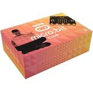
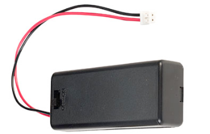
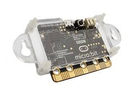
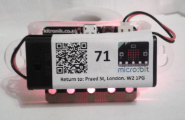
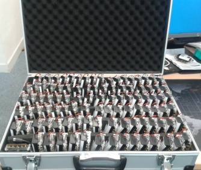

# public-events-microbit-epdemic: Hardware Guide

Below are the list of components required to run an micro:bit
epidemic in the way we have, and some experiences of using 
this hardware on the way.

### 101 micro:bits

* We ordered ten [packs of ten](http://cpc.farnell.com/bbc-micro-bit/mb224-us/bbc-micro-bit-club-fcc-10-pack/dp/ED00316?rpsku=rel2:ED00036&isexcsku=false)
from Farnell (CPC), which included non-famous-brand AAA batteries (quite useful),
battery holders (not so useful, as not switched), and MicroUSB
cables (useful, for as long as they worked). We wanted 100
minions, and one master, hence 101.

* We had one failure out-of-the-box, where a unit caused
Windows to disable the USB port due to excessive power usage. 
Probably this was a short in the USB socket...

* We additionally found that the USB socket on the micro:bit is
not particularly strong, yet plugging/unplugging the cable
requires more force than we expected. In the development 
process, one USB socket became detached from the board, so take
extra care with the unplugging angle.

* We found the USB cables failed after 50-100 uses, and 
windows would start reporting unrecognised USB devices. While
firmware-upgrading and flashing 100 micro:bits in a hurry 
might cause plugging/unplugging to be done efficiently, we do
not think the force used was excessively aggressive; hence the
cables are probably quite weak.

### _100 Switched Battery holders_

* We wanted to be able to
switch the micro:bits on and off without disconnecting the 
fairly fragile power cable from the equally fragile socket. We 
found [RapidOnline](https://www.rapidonline.com/bbc-micro-bit-switched-battery-box-2-x-aaa-18-2899)
supplied switched-battery holders fitted
with the 2-pin plug for micro:bit, which is convenient, but
build quality and design is not perfect.  
  
  * 2 out of 100 had clumsy soldering issues that caused them to be
  always on, regardless of switch position. Fixable - just - by
  prising the plastic casing open and resoldering.
  
  * The design is that the switch, batteries, and most of the
  case are detachable from the thin plastic base; it would have
  been far better if a switch and thin plastic base were the
  detachable part, leaving the batteries and most of the case in
  place.
  
  * The plastic tabs that hold the case shut are quite small, and
  the weight of batteries they hold is significant; we
  are a bit concerned these cases might fall open more often as
  they age. Perhaps look out for a better option.

  * In the meantime, when attaching the lanyard, clip it to not
  only the wallmount hole, but also through the loop of battery
  cable, then the batteries won't fall out very far.
  
### _100 wall-mount cases for micro:bit_. 

* We used [these](http://cpc.farnell.com/kitronik/5605/mi-pro-mountable-case/dp/ED00030). 
These protect the micro:bits nicely, and have screw holes on each side that will fit a
standard lanyard clip.

* They take about a minute to assemble, and have 4 nylon screws
with nuts. However, we only screwed the top two of these, as we
wanted the battery case firmly attached. There is room, just
about, to glue the switched battery unit onto the back, but it 
is very tight, and partially covers the bottom two screw-holes.
This doesn't seem to be a problem though; the case holds 
together firmly enough.

* We also ordered one more standard case for the master, which
didn't need the wall-mount version, as it's always connected 
to a laptop serial port.

### Lanyards and stickers

* We needed 100 lanyards with two clips, and no safety break.
See the [artwork](../artwork) folder for the [pattern](../artwork/microbit-epi-lanyard.png) we went for.
We used our Imperial College approved provider, [www.carddispenseruk.com](www.carddispenseruk.com)

* We also wanted to stick something on the battery case to 
indicate the id of each minion; we used Niceday 2.5 x 1.5" 
stickers.

### Superglue

* We [superglued](https://www.amazon.co.uk/Loctite-Triple-Instant-Adhesive-Bonding/dp/B01BUA92PM/ref=sr_1_7?ie=UTF8&qid=1530712161&sr=8-7&keywords=super+glue+triple) 
the battery case to the micro:bit holder,
and also stuck the power cable to the top (the removable part)
of the battery case to attempt to keep it tidy. It took 6 tubes,
and quite a lot of time.

### A laptop

* To run the epidemic, we used a not particularly
impressive laptop, which happens to be running Windows 7,
so the documentation here will describe that. But there is
no reason why Mac or Linux machines shouldn't work just
as well, since we are using python and the gcc toolchain 
mainly.

### Transport

* Finally, carrying 101 micro:bits around is not entirely straightforward. 
We got a couple of 500x350x120mm aluminium cases with foam inside, and by removing most
of the foam, we could fit all the micro:bits in like this:

* And then in the other case, we stuffed lanyards, batteries, and a few spare parts.
